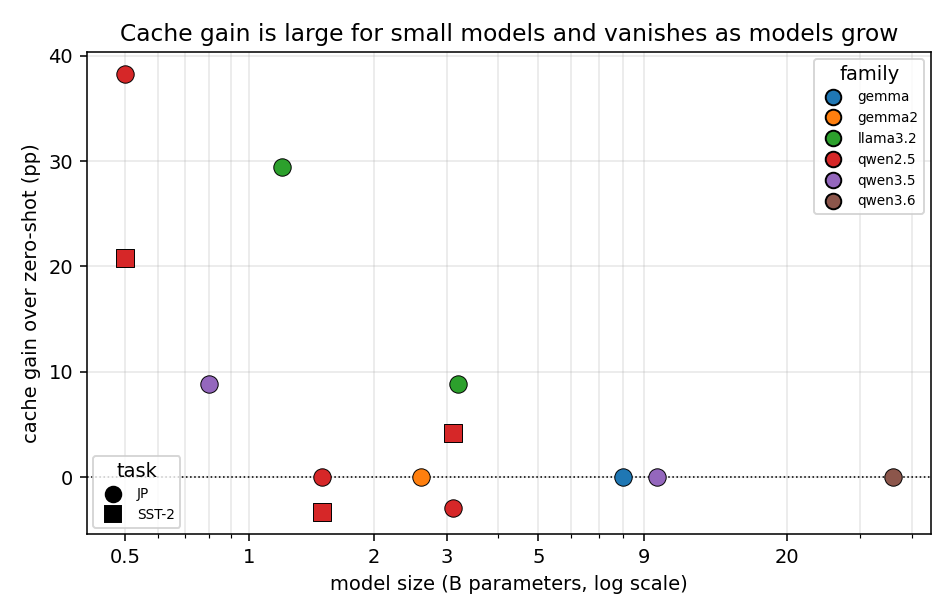
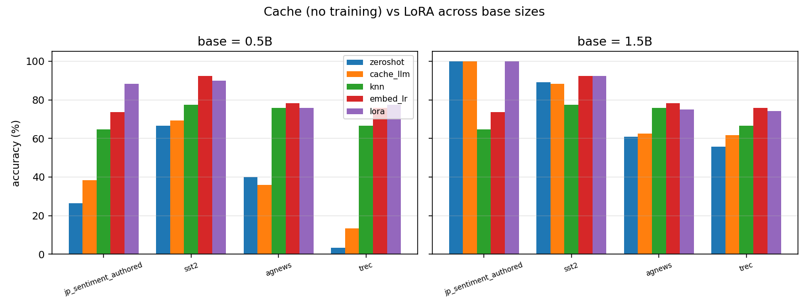
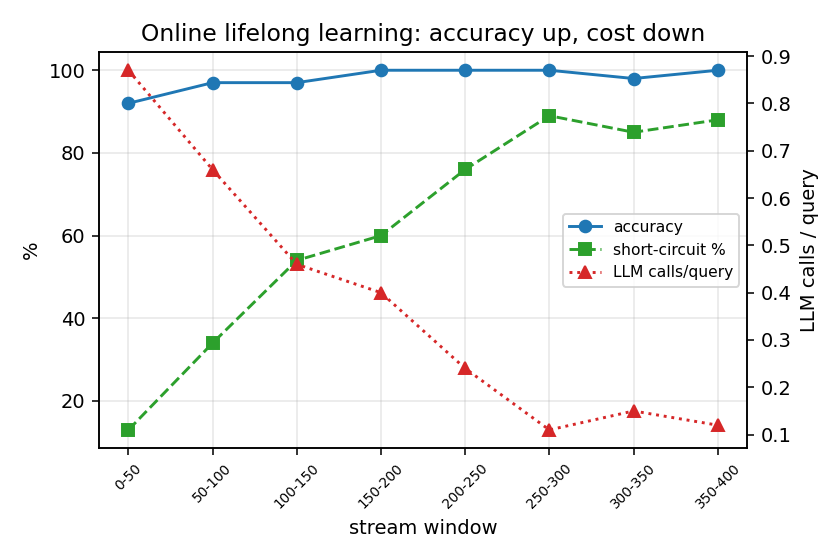
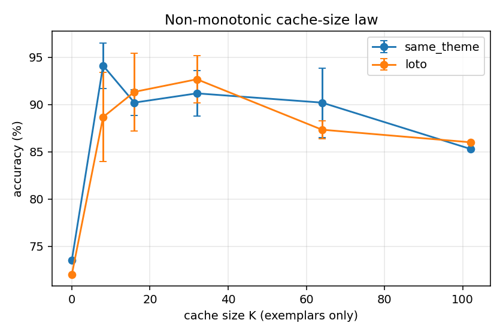
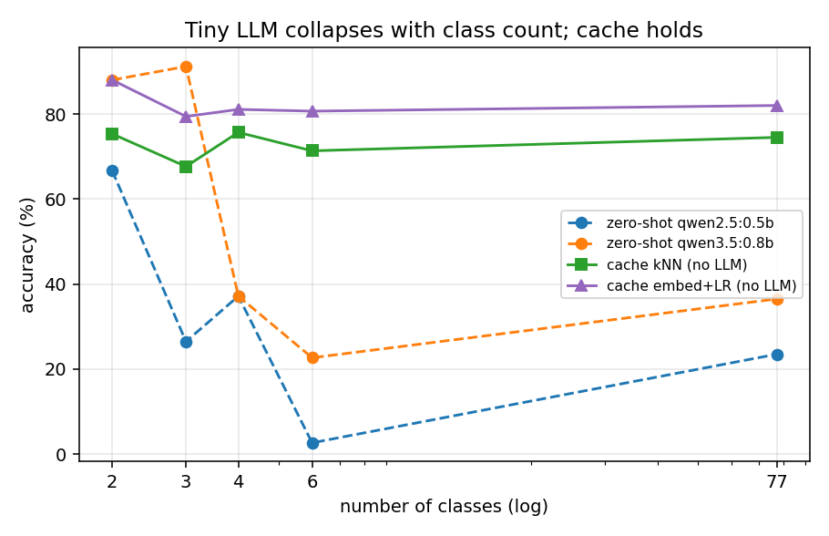
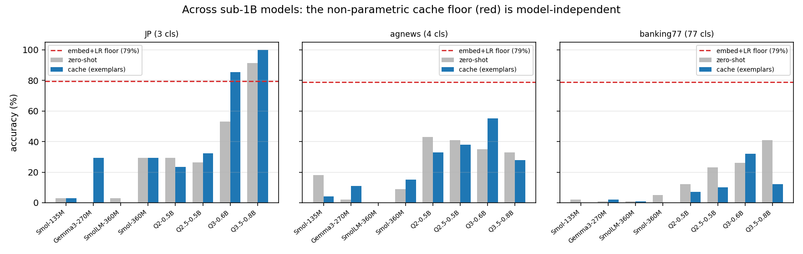
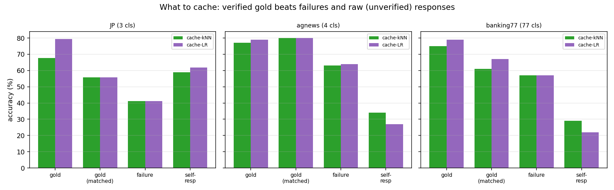

# Cache the Known, Ask Only the Novel: A Confidence-Routed Harness for Sub-1B Language Models


## Abstract

On-device deployment increasingly favors sub-1-billion-parameter ("tiny") language models for their low latency, privacy, and cost, yet such frozen models are unreliable on structured classification. The usual response is to make the model better (fine-tuning, larger models). We argue the opposite for tiny-model systems: do not strengthen the LLM, but **separate the known from the novel** and route each to where it is cheapest and most reliable. We instantiate this as a deterministic harness around a **frozen** sub-1B model with an **experience cache** of verified (text, label) cases, exposing two complementary paths — a non-parametric predictor (embedding kNN / logistic regression) that never calls the LLM, and the LLM conditioned on retrieved exemplars and distilled rules — plus a **confidence gate** that decides between them. The central engineering result is that this gate is principled, not heuristic: the non-parametric classifier's own confidence predicts whether its (no-LLM) answer is correct at mean AUROC 0.83 across seven datasets, whereas nearest-neighbor similarity alone is near chance. Routing by that confidence matches or beats the better single path (85.6% vs 83.9% no-LLM, 57.0% LLM) while sending only ~4% of inputs to the LLM, and exceeds both where they are complementary (e.g., 79/91→97% on Japanese sentiment), approaching an oracle ceiling of 92.1%. A comprehensive sweep (11 datasets × 8 sub-1B models, 88 cells) shows the no-LLM path dominates (71.9% mean vs 26–29% for every LLM-path arm), is nearly invariant to class count (≈80% from 2 to 77 classes), and matches LoRA at zero training cost; structuring the model's own failures into discriminative rules helps the LLM path but only marginally on average, and beats structuring its successes. The LLM remains essential for genuine novelty: on unseen-theme (leave-one-theme-out) queries it generalizes (92%) where the non-parametric path drops (56%). Findings are validated with leave-one-theme-out splits, label-corruption and 1-NN controls, paired McNemar tests, Wilson confidence intervals, and an external re-test on six real-world datasets. The contribution is thus a *system-centric* design principle for sub-1B **classification** deployments — delegate known inputs to deterministic components and spend the LLM only on the genuinely novel — with a validated routing rule that makes it operational. We deliberately scope all claims to closed-set classification, whose outputs are recoverable from verified cases; a generative-QA pilot marks the boundary where the no-LLM path stops transferring, and extending the principle to open-ended generation and reasoning is left to future work.

## 1. Introduction

### A. Why Tiny On-Device Models Matter

The deployment frontier for large language models (LLMs) is shifting from the cloud toward the edge. Sub-1-billion-parameter ("tiny") models that run locally through runtimes such as ollama offer compelling advantages: single-digit-millisecond-to-second latency without network round-trips, full data privacy because no text leaves the device, predictable cost with no per-token API billing, and offline availability. These properties are decisive for applications in regulated domains, intermittent-connectivity settings, and high-volume pipelines where even small per-call costs accumulate. As a result, there is strong practical motivation to make the *smallest possible* model carry useful workloads such as classification, routing, and structured judgment.

### B. Why Frozen Tiny Models Fail Natively

The difficulty is that tiny models, used natively and zero-shot, are unreliable on exactly the tasks practitioners want to delegate to them. Multi-step reasoning, schema-constrained ("structured") output, and fine-grained classification all degrade sharply as parameter count falls. Evidence from the tool-calling literature suggests reliable native tool use emerges only around the tens-of-billions scale \cite{toolcalling_scale}, far beyond the sub-1B regime. In our own preliminary study, a 0.8B model exhibited two concrete failure modes that are easy to misattribute: runaway "thinking-mode" generation and an oversized default context window, rather than the malformed JSON one might first suspect. Worse, the natural remedy—supervised fine-tuning or LoRA adaptation—reintroduces the very costs that motivated going tiny: a training pipeline, labeled-data curation, accelerator time, per-task weight artifacts, and the loss of the ability to instantly incorporate a single newly observed example. For an on-device model expected to adapt continually, weight updates are an awkward fit.

### C. A System-Centric Answer: Separate the Known from the Novel

Our central thesis is **system-centric, not model-centric**: for a tiny-model deployment, the path to performance, cost, and reliability is not to make the LLM stronger but to **separate inputs into "known" and "novel" and route each to where it is cheapest and most reliable** — known inputs to deterministic, non-parametric components, and only the genuinely novel to the LLM. The LLM is the smallest, most expensive, and least reliable part of the system, so a good harness invokes it as little as possible while reserving it for what only it can do (generalize to inputs unlike anything seen before). We instantiate this as a deterministic *Experience-Cache Harness* that *remembers verified-useful experiences, answers known inputs without the model, and gates the rest to the LLM by a validated confidence signal*. Concretely, the harness (i) tunes the LLM client for tiny models (thinking disabled, small `num_ctx`, lenient JSON parsing, structured-error retry); (ii) retrieves relevant verified cases as dynamic few-shot exemplars through a pluggable retriever; (iii) **short-circuits** recurring queries above a similarity threshold to return a cached label with **zero LLM calls**; (iv) distills compact natural-language *insights* from the model's own training-set mistakes (never touching test data or rubric); and (v) escalates ambiguous cases to a stronger teacher model, caching the teacher's answer while tracking provenance so teacher-derived correctness is never credited to the frozen tiny model. This keeps the tiny model's role to a single short final judgment, while the deterministic plane supplies memory, examples, rules, and routing. Because nothing about the model weights changes, the same approach generalizes across model families and sizes, and adaptation is instantaneous: one revealed gold label is immediately available for reuse.

### D. Contributions

This paper makes the following contributions:

- **A system-centric design principle for tiny-model deployments, with a validated routing gate.** We argue that performance/cost/reliability for sub-1B *classification* systems is optimized by separating known from novel inputs and delegating known inputs to deterministic components, spending the LLM only on the novel (we scope claims to closed-set classification; Section \ref{sec:results}-L marks the generative boundary). We make the known/novel decision *operational and principled*: the non-parametric classifier's confidence predicts whether its no-LLM answer is correct at mean AUROC 0.83 across seven datasets (nearest-neighbor similarity alone is near chance), and routing by it matches or beats the best single path at ~4% LLM calls, exceeding both where they are complementary and approaching an oracle ceiling (Section \ref{sec:router}).
- **A comprehensive head-to-head of "what to cache and how to use it" (88 cells).** Across 11 datasets × 8 sub-1B models we show the no-LLM path dominates every LLM-path variant (71.9% vs 26–29% mean); that cache value rests on *label verification* (caching unverified model outputs poisons it); and that structuring the model's own failures into discriminative rules helps the LLM path but only marginally on average, and beats structuring its successes.
- **A systematic study of experience caching for sub-1B models, with a scaling law.** Using a clean parameter ladder (Qwen2.5 0.5B/1.5B/3B) and cross-family models (Qwen3.5-0.8B, Llama-3.2 1B/3B, Gemma2-2B), we show that the accuracy gain from the experience cache *grows as the model shrinks* and diminishes as parameters increase—quantifying when the harness matters most.
- **A non-monotonic cache-size law.** For tiny models with weak retrieval, a *small curated* exemplar cache (K≈8–32) is optimal; enlarging the pool degrades accuracy by injecting noisy "nearest" neighbors. We characterize this inverted-U behavior and its dependence on retriever strength.
- **An insight-versus-exemplar tradeoff with two complementary levers.** Under weak (char n-gram) retrieval, a distilled natural-language *insight*—a rule mined from the model's own training-set errors—dominates raw retrieved exemplars; with a strong (embedding) retriever, exemplars catch up. The cache thus exposes two complementary knobs that practitioners can tune to their retriever.
- **A class-count robustness law and a complementary-regime characterization.** Across tasks from 2 to 77 classes, the non-parametric cache path is nearly invariant to label-space size (≈80%) while the zero-shot tiny LLM, strong on 2–3 classes, collapses below 40% beyond ~3 classes; conversely, on out-of-distribution (leave-one-theme-out) queries the LLM-with-exemplars path generalizes where the non-parametric path fails. The two paths are complementary, and we show a similarity-confident router combining them.
- **A controlled head-to-head against fine-tuning and a supervised baseline, at two base sizes.** Using the *same* labeled data and *same* base model (0.5B and 1.5B), we compare the non-parametric cache (no weight updates) against LoRA fine-tuning and an embedding-plus-logistic-regression baseline, showing the cache matches or beats LoRA on most tasks while adding zero training cost and providing instant 0-LLM-call recall on recurring queries.
- **A reproducibility-first validation methodology.** We re-measure every baseline on the same held-out set, introduce a leave-one-theme-out split that is unsolvable by memorization, define novelty independently of the retriever metric (edit distance) with similarity-stratified accuracy, add 1-NN-no-LLM and label-corruption controls to separate reasoning from exemplar copying, distill rules from train data only (anti rubric-leakage) with an oracle-versus-distilled comparison, and report Wilson 95% confidence intervals, paired McNemar tests, and per-class precision/recall/macro-F1.

The cache helps most where the base model is weakest: on a held-out 0.8B multi-task study it raises TREC from 22.5% to 40.0% and AG News from 32.5% to 44.2% (paired McNemar $p<0.02$); on the leave-one-theme-out controlled set it lifts the already-strong (~90%) zero-shot baseline to 92% while restoring neutral-class recall from ~80% to ~100%, with gains holding on unseen themes (generalization, not memorization). Used as a non-parametric predictor it stays near 80% from 2 to 77 classes and rivals LoRA at zero training cost. Full numbers are in Section \ref{sec:results}.

### E. Paper Organization

The remainder of this paper is organized as follows: Section \ref{sec:related} reviews related work on experiential and case-based memory, in-context example selection, and semantic caching; Section \ref{sec:method} details the Experience-Cache Harness and its components; Section \ref{sec:setup} describes the experimental setup, tasks, and validity controls; Section \ref{sec:results} presents results and ablations; Section \ref{sec:discussion} discusses implications and limitations; and Section \ref{sec:conclusion} concludes.

## 2. Related Work {#sec:related}
This work sits at the intersection of several research threads: learning useful behavior from experience without updating model weights, case-based and memory-augmented agents, retrieval-based selection of in-context examples, semantic caching of model responses, the known biases and robustness limits of in-context learning, and the practical use of small efficient language models. We review each in turn, stating for each cited line of work its relation to and difference from our Experience-Cache Harness.

### A. Experiential and Insight Learning Without Fine-tuning

The closest line of work learns reusable knowledge from a model's own interactions while keeping the underlying weights frozen. ExpeL \cite{zhao2024expel} distills natural-language insights and a pool of retrievable trajectories from a frozen LLM agent's successes and failures, then injects them at inference time; this directly motivates our *insight* lever, in which a distilled rule mined from the model's own errors guides later predictions. We differ by targeting the *sub-1B* regime, where the benefit grows as the model shrinks (Fig. \ref{fig:scaling}); by treating insight and exemplar memory as two separately-ablated levers whose balance shifts with retriever strength; and by mining rules strictly from the training pool, finding that naive lexical rules can *hurt* tiny models — a failure mode not seen at large scale. Reflexion \cite{shinn2023reflexion} similarly uses verbal self-reflection stored in an episodic memory to improve a frozen policy across trials via verbal reinforcement; we share the no-weight-update philosophy but target single-shot classification with a deterministic control plane and verified (text, label) cases rather than free-form reflective traces over multi-step tasks. MemPrompt \cite{madaan2022memprompt} attaches a growing memory of user *corrective feedback* to a deployed frozen model so that recurring error types are corrected at inference; our online lifelong loop (answer → reveal gold → retain) is in the same spirit, but our memory stores verified labeled cases keyed for retrieval and adds a *semantic short-circuit* that returns a cached label with zero LLM calls, which MemPrompt does not.

### B. Case-Based Reasoning and Memory-Augmented Agents

Our experience cache is a concrete instance of case-based reasoning (CBR) adapted to LLM agents. The classical Retrieve–Reuse–Revise–Retain cycle, recently recast for LLM agents \cite{cbr2024llm}, frames the agent as solving a new problem by retrieving similar past cases, reusing and revising their solutions, and retaining the verified outcome; our control plane realizes exactly this loop (retrieve exemplars and rules → tiny-model judgment → retain verified cases) but specializes the "reuse" step with a similarity-thresholded short-circuit and the "revise" step with teacher escalation. Memento \cite{memento2025} builds a non-parametric, continually-growing case bank for LLM agents that enables continual learning without gradient updates; we share the non-parametric continual-learning stance and the cold-start-to-competence trajectory, but our emphasis is (i) the *tiny-model* regime, (ii) a *non-monotonic cache-size law* showing that for weak retrievers a *small curated* exemplar set (K~8–32) outperforms a large pool by avoiding noisy nearest neighbors, and (iii) a head-to-head comparison against parametric fine-tuning on the same data and base model. Where memory-augmented agent work generally assumes a capable backbone, we deliberately push the backbone to the smallest practical size and let the deterministic harness compensate.

### C. Retrieval-Based In-Context Example Selection

A body of work shows that *which* examples populate the prompt matters as much as how many. KATE \cite{liu2022kate} demonstrates that retrieving the k-nearest neighbors of the query as in-context examples substantially outperforms random selection; this justifies our *dynamic retrieved k-shot* arm and our use of a retriever-backed cache rather than a fixed exemplar set. Our contribution beyond KATE is to study this selection *under deliberately weak retrieval* (zero-dependency char n-gram TF-IDF) versus a *stronger embedding retriever* behind one interface, and to show that retrieval quality reshapes the optimal strategy: with weak retrieval a distilled insight dominates raw exemplars, while a strong embedding retriever lets exemplars catch up. We also expose the *non-monotonic* dependence on pool size for tiny models, which kNN-selection studies on large models do not report, and we include a 1-NN-no-LLM copy baseline and a label-corruption probe to separate genuine reasoning over retrieved context from mere nearest-neighbor copying. The non-parametric cache path itself connects to retrieval-augmented LMs that interpolate predictions from neighbors (kNN-LM \cite{khandelwal2020knnlm}) and to few-shot text classifiers built on a frozen sentence encoder plus a lightweight head (SetFit \cite{tunstall2022setfit}) or class prototypes (prototypical networks \cite{snell2017prototypical}); we differ by using this predictor as one of two interchangeable cache paths and by quantifying when it should replace the tiny LLM entirely.

### D. Semantic Caching of Model Responses

The short-circuit component relates to semantic caching of LLM calls. GPTCache and similar systems \cite{bang2023gptcache} cache prior responses and serve them when a new query's embedding similarity to a cached query exceeds a threshold τ, cutting API cost and latency. We adopt the same τ-thresholded hit mechanism, but our cache is *label-verified* (entries carry confirmed gold labels rather than arbitrary generations) and is integrated with retrieval-augmented prompting and teacher escalation rather than used purely as a response cache. The novel angle is *quantifying the short-circuit's effect for a frozen tiny model on a classification task*: Fig. \ref{fig:online} reports the fraction of online queries served with zero LLM calls and the resulting reduction in calls and latency, alongside provenance tracking that ensures cache-served and teacher-served answers are never credited to the frozen tiny model. Thus semantic caching contributes the reuse mechanism, while our work contributes its measured value within an accuracy-preserving control plane for sub-1B models.

### E. In-Context Biases and Retrieval Robustness

In-context learning is known to be brittle to the *arrangement* and *content* of the prompt. Studies of example ordering, recency, and majority-label bias \cite{zhao2021calibrate, lu2022order} show that permutation and label distribution alone can swing accuracy dramatically; these biases are amplified for weak models and motivate our matched-budget controls (static random k-shot with identical k and token budget), our label-corruption probe, and our neutral-class over-correction check. Separately, work on the robustness of retrieval-augmented LMs to *irrelevant or distracting context* \cite{shi2023distract, yoran2024robust} shows that low-quality retrieved passages can degrade rather than help generation. This directly justifies two of our design choices: the non-monotonic cache-size finding (a large pool injects noisy neighbors that hurt tiny models) and the *low-similarity escalation* policy, in which the control plane routes to a stronger teacher precisely when retrieval similarity is low and the retrieved context is therefore likely unhelpful. Our work extends this robustness literature by characterizing it specifically for sub-1B classifiers and by defining novelty *independently of the retriever metric* (via edit distance) so that similarity-stratified accuracy isolates the effect of weak retrieval from memorization.

### F. Small and Efficient Language Models

Finally, our work is positioned against the practical reality that small LLMs are unreliable on their own. Practitioner benchmarks suggest that robust native tool use emerges only around the tens-of-billions-parameter scale \cite{toolcalling_scale} (a non-peer-reviewed source, cited as indicative), implying that a raw sub-1B model is insufficient as a standalone agent. Parameter-efficient fine-tuning, exemplified by LoRA \cite{hu2022lora}, is the standard parametric route to specializing such models without full fine-tuning; we use LoRA on the same base model and labeled data as a *baseline*, and additionally compare against an embedding-plus-logistic-regression supervised baseline, to show that our non-parametric cache is competitive while adding *zero* training cost and providing instant zero-LLM-call recall on recurring queries (Table \ref{tab:finetune}). The broader takeaway, consistent with the "harness over raw model" view, is that for sub-1B models the deterministic control plane — not additional parameters — is the dominant source of usable accuracy. Our contribution is to make this claim *measurable*: a like-for-like comparison of cache versus fine-tuning under shared data, base model, and held-out evaluation, with Wilson confidence intervals and paired McNemar tests establishing that the gains are statistically real and generalize to unseen themes.

### G. Cascades, Routing, and Selective Prediction

Our confidence gate (Section \ref{sec:router}) sits in a growing literature on spending expensive computation only when needed. LLM *cascades* such as FrugalGPT \cite{chen2023frugalgpt} call a cheap model first and escalate to a stronger one when a learned scorer judges the answer unreliable; *query routers* such as RouteLLM \cite{ong2024routellm} and Hybrid-LLM \cite{ding2024hybridllm} learn to send easy queries to a weak LLM and hard ones to a strong LLM; and *adaptive retrieval* methods such as Self-RAG \cite{asai2024selfrag} learn when to retrieve rather than retrieving always. We share the selective-computation principle but differ in three ways. First, our cheap arm invokes *no language model at all* — a non-parametric classifier over a frozen embedding answers known inputs — so routing saves the *entire* generative call, not merely the gap between a small and a large LLM. Second, our gate is not a separately-trained router but the deciding classifier's *own confidence*, a classic selective-prediction / reject-option signal \cite{geifman2017selective}, which we *validate* as a known/novel detector (AUROC 0.83) rather than assume. Third, we study this in the *sub-1B* regime and quantify the full accuracy–cost frontier against an oracle. In effect, we cast tiny-model deployment as selective classification in which the deferral target is the LLM, invoked only for inputs the deterministic predictor declines.

## 3. Method {#sec:method}
We formalize the *Experience-Cache Harness*: a deterministic control plane that wraps a frozen sub-1B language model and an append-only memory of verified experiences. No model weights are ever updated. The language model is invoked only for a short final judgment, and on recurring or near-duplicate inputs it is not invoked at all.

### A. Problem Setup

Let $f_\theta$ be a frozen autoregressive language model with parameters $\theta$ held fixed throughout (no fine-tuning, no gradient updates). We target single-label classification: given an input text $x \in \mathcal{X}$, predict a label $y \in \mathcal{Y}$, where $\mathcal{Y}=\{y_1,\dots,y_m\}$ is a small task-defined label set (e.g., $\mathcal{Y}=\{\textsf{positive},\textsf{negative},\textsf{neutral}\}$).

A task is specified by a language-agnostic tuple $T=(\textsf{name}, \mathcal{Y}, \iota, \ell)$ where $\iota$ is a natural-language instruction and $\ell\in\{\textsf{ja},\textsf{en}\}$ selects the prompt-rendering frame. All harness components (retriever, cache, rule distillation, control plane) depend only on $T$, so the same machinery transfers across sentiment, topic, and question-type classification without code changes.

We are given a labeled *experience pool* partitioned into disjoint splits:
$$
\mathcal{D}_{\text{train}},\quad \mathcal{D}_{\text{dev}},\quad \mathcal{D}_{\text{test}}\subset \mathcal{X}\times\mathcal{Y}.
$$
Hyperparameters are tuned **on $\mathcal{D}_{\text{dev}}$ only** and then frozen; $\mathcal{D}_{\text{test}}$ is scored exactly once. Crucially, rule distillation (Sec. E) consumes **$\mathcal{D}_{\text{train}}$ only**, so the held-out set and any human rubric remain unseen, eliminating rubric leakage \cite{zhao2024expel}.

### B. Experience Cache $\mathcal{C}$

The cache $\mathcal{C}$ is an ordered, append-only set of *experiences*. An experience is the immutable record
$$
e = (\textsf{text},\, \textsf{label},\, \textsf{insight},\, \textsf{src},\, \textsf{theme}),
$$
where $\textsf{src}\in\{\textsf{gold},\textsf{teacher},\textsf{self}\}$ tracks provenance (who verified the label) and $\textsf{theme}$ supports leakage auditing and the leave-one-theme-out split. Provenance is load-bearing: a label produced by the teacher model is never credited to the frozen student (Sec. F).

The cache exposes three operations, all delegating to a pluggable retriever (Sec. C):

- $\textsf{add}(e)$: assign a document id, append $e$, and index $e.\textsf{text}$.
- $\textsf{retrieve}(x,k)\rightarrow [(e_i, s_i)]_{i=1}^{k}$: return the top-$k$ experiences by similarity, sorted in descending $s_i$, for use as dynamic few-shot exemplars.
- $\textsf{shortCircuit}(x,\tau)$: return the single nearest experience iff its similarity $\ge\tau$, else $\bot$ (Sec. D).

The cache is persisted as JSON, giving lifelong cross-session memory: it is reconstructed by replaying $\textsf{add}$ over the stored records.

### C. Retriever and Similarity Function

The cache depends only on a retriever interface (a `Protocol` with `add` and `search`), so the similarity backend is swappable behind one contract. We study two instantiations.

**1) Character $n$-gram TF–IDF cosine (default, zero-dependency).** For text $x$ we extract the multiset of character $n$-grams $G(x)$ with $n\in\{2,3\}$ (no tokenizer required, which is robust for short Japanese text). Document frequency $\mathrm{df}(g)$ is accumulated incrementally, and the smoothed inverse document frequency is
$$
\mathrm{idf}(g)=\log\!\frac{1+N}{1+\mathrm{df}(g)}+1,
$$
with $N$ the number of indexed documents. The TF–IDF vector is $\mathbf{v}(x)[g]=\mathrm{tf}(g)\cdot\mathrm{idf}(g)$.

**2) Embedding retriever (stronger paraphrase recall).** An external embedding model (`nomic-embed-text` via ollama) maps $x\mapsto\boldsymbol{\phi}(x)\in\mathbb{R}^{d}$. Embeddings are memoized to avoid recomputation. This backend is isolated so the stdlib core never imports it; it is activated only in the embedding ablation arm.

Both backends define the **similarity function** as cosine,
$$
\mathrm{sim}(x,x')=\frac{\langle \mathbf{u}(x),\mathbf{u}(x')\rangle}{\lVert \mathbf{u}(x)\rVert\,\lVert \mathbf{u}(x')\rVert}\in[0,1],
$$
where $\mathbf{u}=\mathbf{v}$ for the $n$-gram retriever and $\mathbf{u}=\boldsymbol{\phi}$ for the embedding retriever. This single $\mathrm{sim}(\cdot,\cdot)$ drives both retrieval ranking and the short-circuit/escalation gates, so the two cache levers share one geometry.

### D. Semantic Short-Circuit Rule

Before any model call, the control plane consults the cache for a near-exact match. Given threshold $\tau_{\text{sc}}$ (default $0.92$, tuned on $\mathcal{D}_{\text{dev}}$):
$$
\textsf{shortCircuit}(x,\tau_{\text{sc}})=
\begin{cases}
(e^\star, s^\star) & \text{if } s^\star \ge \tau_{\text{sc}},\\
\bot & \text{otherwise,}
\end{cases}
$$
where $(e^\star,s^\star)=\arg\max_{e\in\mathcal{C}}\ \mathrm{sim}(x,e.\textsf{text})$ is the nearest cached experience.
On a hit, the harness returns the cached label $e^\star.\textsf{label}$ with **zero LLM calls** and near-zero latency (provenance $\textsf{source}=\textsf{short\_circuit}$). This realizes instant recall on repeated and near-duplicate queries, analogous to $\tau$-thresholded semantic caching \cite{bang2023gptcache}, but the cached unit is a verified labeled experience rather than a prior model completion.

### E. Data-Driven Rule Distillation

The cache's second lever is a small set of distilled natural-language *insights* (rules) mined from the frozen model's **own** mistakes on $\mathcal{D}_{\text{train}}$. The procedure is label- and language-agnostic; it discovers discriminative cues *per confusion pair* rather than assuming any fixed rubric.

Let $\mathcal{E}=\{(x,g,p): (x,g)\in\mathcal{D}_{\text{train}},\ p=\hat y(x),\ p\neq g\}$ be the student's train misclassifications, where $g$ is gold and $p$ the predicted label. For each confusion pair $(g,p)$ (processed most-frequent first), define the contrast sets
$$
P=\{x:(x,g)\in\mathcal{D}_{\text{train}}\},\qquad
Q=\{x:(x,p)\in\mathcal{D}_{\text{train}}\},
$$
i.e., the true-$g$ texts versus the texts of the class they were confused *with*. We extract content-bearing tokens $\textsf{tok}(x)$ ($\ge 3$-char alphabetic words with stop-word removal for English; content-character 3-grams for Japanese) and score each token by its discriminativeness toward $g$,
$$
\mathrm{score}(t)=\frac{\mathrm{df}_P(t)}{1+\mathrm{df}_Q(t)},
$$
keeping the top tokens with $\mathrm{df}_P(t)\ge 2$ and $\mathrm{score}(t)>1.5$. The surviving cues are rendered as one compact guidance line, e.g. *"If it contains [$c_1,\dots,c_r$], prefer $g$ (often misread as $p$)."* The distiller emits at most $\textsf{max\_rules}$ (default 4) such lines, one per most-confused pair. We additionally provide a hand-authored *oracle* rule set for a leakage-detecting comparison (Sec. F): if distilled $\approx$ oracle, the rules encode legitimate learning rather than test leakage.

### F. Prompt Assembly

Prompts are assembled in one place to keep ablation arms differing only in *what content is supplied*. The user message concatenates, in order: (i) the task instruction $\iota$; (ii) a rules block (omitted if rules off); (iii) an exemplars block (omitted if $k=0$); (iv) the query $x$; (v) a JSON-only answer suffix `{"label": "<y_1>|...|<y_m>"}`.

Two design choices respect the sub-1B context budget. First, exemplars are rendered under a **character budget** $B$ (default $1600$): lines are admitted from most- to least-similar until $B$ is reached. Second, exemplars are ordered with the **most similar last** (immediately before the query), turning recency bias into an ally \cite{lu2022order}. Low-signal exemplars below $\textsf{minSim}$ are dropped, and $k$-shot selection is class-balanced to counter majority-label bias \cite{liu2022kate}.

### G. Control-Plane Decision Flow

The control plane is deterministic; $f_\theta$ is queried at temperature $0$ with $\textsf{think}=\textsf{false}$ and a small context window ($\textsf{num\_ctx}=4096$), lenient JSON extraction, and structured-error returns — the PoC identified thinking-mode runaway and the default huge context, not malformed JSON, as the true failure mode for a 0.8B model. The per-query decision is:

1. **Short-circuit.** If enabled and $\textsf{shortCircuit}(x,\tau_{\text{sc}})$ hits, return the cached label (0 calls).
2. **Retrieve + rules.** Otherwise build exemplars via $\textsf{retrieve}$ (gated by $\textsf{minSim}$, class-balanced, budgeted) and attach the distilled rules; record the top retrieval score $s_{\text{top}}$.
3. **Cold-context escalation.** If escalation and retrieval are enabled and $s_{\text{top}}<\tau_{\text{esc}}$ (default $0.30$), route directly to the teacher — low similarity signals an out-of-distribution / cold-start context where retrieved exemplars are likely irrelevant \cite{yoran2024robust}.
4. **Student call.** Otherwise call the frozen student $f_\theta$, then lenient-parse the output into $(\textsf{label},\textsf{valid},\textsf{ambiguous})$.
5. **Ambiguity escalation.** If escalation is on and the student parse is invalid or ambiguous, re-issue the *same* prompt to the teacher and cache its answer with $\textsf{src}=\textsf{teacher}$.

Every `Prediction` carries its provenance `source` — one of short-circuit, student, teacher, student-then-teacher, or nn-copy — together with `n_llm_calls`, so frozen-student-only accuracy is reported separately from teacher-assisted accuracy and from the cost overhead the teacher adds.

```text
Algorithm 1: classify(x)
Input: query x; cache C; rules R; settings S; client; task T
Output: Prediction with label, source, n_llm_calls
1.  if mode = NN_COPY:                       # 1-NN-no-LLM control
2.      H ← C.retrieve(x, S.k)
3.      return majority_label(H), source=nn_copy, calls=0
4.  if S.use_short_circuit and C ≠ ∅:
5.      hit ← C.shortCircuit(x, S.tau_sc)
6.      if hit ≠ ⊥: return hit.label, source=short_circuit, calls=0
7.  (E, s_top) ← build_exemplars(x, C, S)    # gated, balanced, budgeted; ∅ if k=0
8.  if S.use_escalation and S.use_retrieval and s_top < S.tau_esc:
9.      msg ← assemble(T, R if use_rules else ∅, E, x)
10.     return call(teacher, msg), source=teacher, calls=1
11. msg ← assemble(T, R if use_rules else ∅, E, x)
12. (y, valid, amb) ← call(student, msg)
13. if S.use_escalation and (amb or not valid):
14.     (y', ...) ← call(teacher, msg)
15.     return y', source=student_then_teacher, calls=2
16. return y, source=student, calls=1
```

```text
Algorithm 2: distill_rules(train_eval, T)
Input: train_eval = [(x, g, p)] over D_train only; task T; max_rules
Output: tuple of NL guidance lines
1.  errors ← {(x,g,p) ∈ train_eval : g ≠ p}
2.  if errors = ∅: return ()
3.  pairs ← confusion pairs (g,p) in errors, sorted by frequency desc
4.  R ← []
5.  for (g, p) in pairs:
6.      P ← {x : (x,g,·) ∈ train_eval}        # true-g texts
7.      Q ← {x : (x,p,·) ∈ train_eval}        # confused-with texts
8.      cues ← mine_cues(P, Q, T.lang)        # df_P/(1+df_Q) > 1.5, df_P ≥ 2, top-r
9.      if cues = ∅: continue
10.     R.append("If contains [cues], prefer g (often misread as p)")
11.     if |R| ≥ max_rules: break
12. return tuple(R)
```

### H. Online Lifelong-Learning Loop with Self-Distillation

In the deployed setting the system starts **cold** — empty cache, no rules, behaving as the bare frozen model — and improves purely from streamed feedback, with no weight updates. For each arriving $x_t$:

1. **Answer** via `classify` (Alg. 1) using the current cache and rules.
2. **Reveal gold** $y_t$ and **retain** the verified experience: $\mathcal{C}\leftarrow\mathcal{C}\cup\{(x_t,y_t,\textsf{src}=\textsf{gold})\}$. Only student-sourced predictions are appended to an error log $\mathcal{L}$ (to keep self-distillation honest about the *frozen model's* errors).
3. **Periodic self-distillation.** Every $\rho$ steps (default $\rho=40$), refresh the persistent rule set $R\leftarrow\textsf{distillRules}(\mathcal{L},T)$ from the model's accumulated mistakes.

This instantiates the Retrieve–Reuse–Revise–Retain loop of case-based reasoning \cite{cbr2024llm} over a non-parametric case bank \cite{memento2025}, with verbal self-improvement in the spirit of experiential insight distillation \cite{zhao2024expel} and reflective memory \cite{shinn2023reflexion}, and corrective-feedback memory for a deployed frozen model \cite{madaan2022memprompt}. As experiences accumulate, two regimes emerge: **first-occurrence** inputs exercise genuine generalization through retrieved exemplars and distilled rules, while **recurring** inputs are answered by the semantic short-circuit at zero LLM cost. Fig. \ref{fig:online} reports the resulting joint trajectory of accuracy, short-circuit rate, LLM calls per query, and latency over the stream.

### I. Controls and Determinism

To separate reasoning from rote copying, the method is evaluated against a **1-NN-no-LLM** majority-copy baseline ($\textsf{mode}=\textsf{nn\_copy}$) and a **label-corrupted exemplar** probe (a one-step label rotation applied to retrieved exemplars). Novelty is defined **independently of the retriever metric** using a `difflib` edit-ratio so that generalization is not measured by the same quantity it is retrieved by, and accuracy is reported stratified by similarity. Determinism is verified by re-issuing identical prompts at temperature $0$; responses are bit-identical, and a memoizing response cache (distinct from the experience cache $\mathcal{C}$) makes re-runs instantaneous without affecting results. Statistical reporting uses Wilson 95\% confidence intervals, paired McNemar tests, and per-class precision/recall/macro-F1 (Sec. \ref{sec:setup}).

## 4. Experimental Setup {#sec:setup}
This section specifies the datasets, models, ablation arms, evaluation metrics, and validity controls used to test the central claim: that a deterministic control plane with an experience cache lets a *frozen* sub-1B language model approach the accuracy of fine-tuning at near-zero added cost. All experiments are designed to be reproducible: the full pipeline is implemented in the Python standard library (the only optional third-party dependencies are `scikit-learn` and `transformers`/`peft`, used solely for the supervised and LoRA *baselines*), every model call is executed at `temperature = 0` for determinism, and all responses are memoized to a content-addressed cache so that re-runs are bit-identical and require no further model calls.

### A. Datasets and Tasks

We evaluate on four classification tasks behind a single task abstraction (Table \ref{tab:tasks}), so that the harness (retriever, cache, rule distillation, classifier) is agnostic to label set and language and transfers unchanged across tasks.

**Controlled Japanese sentiment set (authored).** The primary instrument is a purpose-built Japanese three-class sentiment corpus (`positive` / `negative` / `neutral`) with explicit *theme* structure. It contains 170 items organized into 34 themes; each theme belongs to a single class and contributes five lexically distinct paraphrase variants. The class composition is **50 positive** (10 themes), **50 negative** (10 themes), and **70 neutral** (14 themes). `neutral` is deliberately over-represented because it is the known failure mode of the base model. The 14 neutral themes are further partitioned into **10 *in-rule* themes** (objective, templatic facts: business hours, price, dimensions, shipping time, location, color variants, file size, support days, manuals, scheduled events) and **4 *out-of-rule* themes** (general facts about geography, language, history, and science). This `in_rule`/`out_of_rule` flag exists specifically to test whether a distilled rule over-generalizes beyond the templatic neutral cases it was mined from. Variants within a theme are written with intentionally different vocabulary so that surface n-gram copying cannot solve the task.

The theme structure enables two complementary splits:

- **Same-theme split.** Within every theme the five variants are partitioned into train/dev/test, so every theme appears in all three sets but with *unseen surface expressions* at test time. This measures generalization to novel wording of known themes (sizes: train = 102, dev = 34, test = 34).
- **Leave-one-theme-out (LOTO) split.** Whole themes are held out for dev/test (per class: ~30% of themes to test, ~15% to dev, remainder to train), so test themes are *never seen in any form* during training or rule distillation. This is the headline generalization test: it **cannot be solved by memorization** (sizes: train = 90, dev = 30, test = 50).

**Public benchmarks.** To establish cross-domain and cross-language robustness, we add three standard English benchmarks with balanced train/dev/test splits: **SST-2** (2-class sentiment: `positive`, `negative`; 180/60/150), **AG News** (4-class topic: `world`, `sports`, `business`, `scitech`; 180/60/148), and **TREC** (6-class question type: `abbr`, `entity`, `description`, `human`, `location`, `number`; 180/60/150) \cite{socher2013sst,zhang2015agnews,li2002trec}. All splits are class-balanced by construction (e.g., 30 items per class per benchmark in train; 25 per class in TREC test) to keep majority-label bias \cite{zhao2021calibrate} out of the accuracy figures.

| Dataset | Lang | \#Cls | Task | Train/Dev/Test |
|---|---|---|---|---|
| JP sentiment (authored) | ja | 3 | sentiment | 102/34/34 same-theme; 90/30/50 LOTO |
| SST-2 | en | 2 | sentiment | 180/60/150 |
| AG News | en | 4 | topic | 180/60/148 |
| TREC | en | 6 | question-type | 180/60/150 |
| Banking77 | en | 77 | intent | 385/154/231 |
| IMDB | en | 2 | sentiment | 50/16/150 |
| Airline (Kaggle) | en | 3 | sentiment | 75/24/150 |
| Tweet (Kaggle) | en | 3 | sentiment | 75/24/150 |
| Yelp | en | 5 | rating | 125/40/150 |
| Emotion | en | 6 | emotion | 150/48/150 |
| DBpedia | en | 14 | topic | 350/112/140 |
| web-questions | en | -- | generative QA | 300/--/150 |

: Datasets and tasks (2 to 77 classes; authored, benchmark, and real-world sources). \label{tab:tasks}

### B. Models

All inference models run locally under `ollama` (v0.21, macOS Metal). Following the prior PoC finding that the real barrier for tiny models is *thinking-mode runaway and an oversized default context window* (not malformed JSON), every student call uses `think = false`, `num_ctx = 4096`, `temperature = 0`, and a lenient JSON parser with structured-error retry.

- **Student ladder.** A clean Qwen2.5 parameter ladder — **Qwen2.5-{0.5B, 1.5B, 3B}** — is used to estimate the cache-gain-vs-parameters scaling relationship within one family. **Qwen3.5-0.8B** is the primary sub-1B subject used throughout the ablations.
- **Cross-family robustness.** **Llama-3.2-{1B, 3B}** and **Gemma2-2B** test that findings are not Qwen-specific.
- **Teacher (escalation).** **Qwen2.5-coder** serves as the stronger model the control plane escalates to on low retrieval similarity or ambiguous parses. Its answers are tracked by *provenance* and reported as a separate cost result, never credited to the frozen student.
- **Embeddings.** **nomic-embed-text** provides the strong (paraphrase-aware) retriever, contrasted against the zero-dependency char n-gram TF-IDF default.
- **Fine-tuning baseline.** **LoRA** (rank 8, $\alpha = 16$, dropout 0.05, target modules `q_proj`/`v_proj`, 3 epochs, AdamW lr $10^{-4}$) on **Qwen2.5-0.5B-Instruct** (HuggingFace, MPS), evaluated with verbalizer scoring (argmax over per-label log-likelihood) for robustness.
- **Supervised lower bound.** nomic embeddings + multinomial **logistic regression** trained on the same train labels.

The cache, LoRA, and embedding+LR baselines all consume the **same labeled training data** and (for cache vs LoRA) the **same base model family**, isolating the effect of the non-parametric cache against weight updates and against a conventional supervised classifier.

### C. Ablation Arms

The control plane switches behavior purely through configuration flags, with prompt formatting centralized so that token budget and $k$ are held constant across arms. Each split is evaluated under the following arms; the right column states what each arm *isolates*.

| Arm | Configuration | Isolates |
|---|---|---|
| **a. Zero-shot baseline** | frozen student, no exemplars, no rules | re-measured starting point on the *exact* test set |
| **b. Static random $k$-shot** | $k$ fixed random exemplars, rules off | the value of *having examples at all* (matched $k$ & token budget) \cite{brown2020gpt3} |
| **c. Dynamic retrieved $k$-shot** | top-$k$ retrieved exemplars, rules off | the marginal value of *relevance* in selection \cite{liu2022kate} |
| **d. Rules-only ($k = 0$)** | distilled NL insight only, no exemplars | the value of a *mined insight* with zero retrieval |
| **e. Cache (dynamic + rules)** | retrieved exemplars + distilled rules | the combined two-lever cache |
| **f. + Semantic short-circuit** | (e) plus $\tau$-thresholded cache hit → 0 LLM calls | instant reuse on near-exact repeats \cite{bang2023gptcache} |
| **g. + Teacher escalation** | (f) plus escalate on low similarity / ambiguous parse | the accuracy ceiling with a teacher (cost reported separately) |
| **h. 1-NN-no-LLM copy** | majority label of retrieved neighbors, *no LLM* | the share of accuracy attributable to *pure exemplar copying* |
| **i. Label-corrupted exemplar** | retrieved exemplars with rotated (wrong) labels | whether the model *reasons* over exemplars or merely copies them |
| **j. Oracle vs auto-distilled rules** | hand-authored rubric rules in place of mined rules | whether auto-distilled rules leak the rubric or are legitimately learned |

: Ablation arms and the factor each isolates. \label{tab:ablation}

Two further studies sweep continuous factors: a **cache-size curve** ($K \in \{0, 8, 16, 32, 64, 102\}$, exemplars only, multi-seed) to test the non-monotonic optimum, and a **retriever comparison** (char n-gram vs nomic embedding, exemplars only) to test the insight-vs-exemplar tradeoff under weak vs strong retrieval. An **online lifelong loop** (cold start → answer → reveal gold → retain → periodic self-distillation) reports the trajectory of accuracy, short-circuit rate, LLM calls per query, and latency as experience accumulates.

### D. Evaluation Metrics

For every arm we report (Tables \ref{tab:ablation}–\ref{tab:seeds} and the figures):

- **Accuracy** with a **Wilson 95% confidence interval** (chosen because it does not degenerate at small $n$).
- **Macro-F1** and **per-class precision / recall**, with explicit attention to **neutral recall** (the documented failure class) and a **neutral over-correction check** (does fixing recall collapse precision?).
- **Paired McNemar test** (one-sided) on the *same* test set, reporting discordant counts $b$ (base-only correct) and $c$ (variant-only correct) and the binomial $p$-value, so improvements are tested *within-item* rather than against an independent sample.
- **Novelty-stratified accuracy:** accuracy restricted to *novel* test items, where novelty is defined **independently of the retrieval metric** using an edit-distance ratio (`difflib`). This separates genuine generalization from near-duplicate recall.
- **Cost:** total **LLM calls** (short-circuit and 1-NN-copy arms cost 0), **LLM calls per query**, and **latency** (mean / median / p90). For the online loop these are tracked over time to quantify the compute saved by reuse.
- A **leakage audit** per split: exact train↔test overlap count, and the max/mean/p90 of the edit-distance ratio *and* the retrieval cosine, confirming no near-neighbor leakage.

### E. Threats to Validity / Controls

We enumerate each control and the specific confound it removes. These were fixed by adversarial review *before* implementation, not added post hoc.

- **Re-measured baseline (history-bias / apples-to-oranges).** The zero-shot baseline is measured on the *identical* held-out set used for every cache arm; we never compare against historical numbers from a different sample. **Removes** the confound of comparing a new method to a stale, differently-sampled baseline.
- **LOTO split (memorization confound).** Whole themes are withheld from train, dev, *and* rule distillation, so test inputs cannot be answered by recall of a seen theme. **Removes** the possibility that gains reflect memorized cases rather than generalization; a gain that survives LOTO is genuine.
- **Retriever-independent novelty (metric circularity).** Novelty is defined by edit-distance ratio, a *different* metric from the retriever's cosine, and accuracy is stratified by it. **Removes** the circularity of using the retriever's own similarity to declare what counts as "novel."
- **1-NN-no-LLM control (exemplar-copying confound).** Arm **h** answers by copying the majority neighbor label with no model call. **Removes** the alternative explanation that the full system is merely a nearest-neighbor classifier; the system must beat this copy baseline by a wide margin to credit the model's reasoning.
- **Label-corruption probe (copy-vs-reason confound).** Arm **i** rotates exemplar labels to wrong values. **Removes** ambiguity about *how* exemplars help: a drop under corruption shows the model is genuinely conditioning on exemplar labels rather than ignoring them, while resilience would show pure pattern copying.
- **Train-only rule distillation (rubric leakage).** Rules are mined *only* from the model's own misclassifications on the **train** pool; the test set and any human rubric are never visible to the distiller. **Removes** the risk that "learned" rules secretly encode the answer key.
- **Oracle-vs-distilled comparison (leakage detection).** Arm **j** swaps auto-distilled rules for a hand-authored rubric. **Removes** doubt about distillation quality: distilled $\approx$ oracle indicates the mined rules are legitimate generalizations rather than overfit or leaked artifacts. The `in_rule`/`out_of_rule` neutral partition additionally tests for rule over-generalization.
- **Provenance separation (credit confound).** Every prediction records its source (`short_circuit` / `student` / `teacher` / `nn_copy`). The headline result is **frozen-student-only**; teacher-escalation accuracy is reported as a *separate* cost-bearing result. **Removes** the confound of crediting a stronger model's answers to the tiny frozen one.
- **Dev-only hyperparameter tuning (test-set leakage).** All thresholds ($\tau$ for short-circuit and escalation, $k$, exemplar similarity gate, prompt budget) are tuned on **dev** and frozen before the test set is touched once. **Removes** optimistic bias from tuning on the evaluation data.
- **Matched-budget arms (free-lunch confound).** Static and dynamic $k$-shot arms use identical $k$ and token budget, with class-balanced exemplar selection. **Removes** the alternative that gains come merely from a longer prompt or a favorable label mix.
- **Statistical rigor at small $n$.** Wilson CIs, paired McNemar, per-class F1, and multi-seed curves are reported throughout; we do not over-claim from point estimates on small test sets. **Removes** the risk of reading noise as signal.
- **Determinism (reproducibility confound).** Every call uses `temperature = 0`; we verify that the same prompt yields a bit-identical response across three runs, and all responses are memoized in a persistent cache. **Removes** run-to-run variance and makes the reported numbers exactly reproducible.

Limitations are consolidated in Section \ref{sec:discussion}.

## 5. Results {#sec:results}

We report two studies: a *controlled* study on the authored Japanese set that establishes generalization rather than memorization, and a *broad* study under the unified pipeline across four tasks, a scaling ladder up to 36B, an eight-model sub-1B sweep, and a fine-tuning comparison at two base sizes. Test-set sizes vary by study (Table \ref{tab:tasks}) and zero-shot is re-measured within each study, so a model's accuracy can differ by a few points across tables; statistics (temperature-0 determinism, Wilson 95% CIs, paired McNemar) follow Section \ref{sec:setup}-D. We write **cache-kNN** for the nearest-neighbor majority predictor over the cache and **cache-LR** (= embed+LR) for a logistic-regression head on the embeddings; both bypass the LLM.

### A. Tiny models are unreliable, and the failure worsens with class count

Zero-shot accuracy of the frozen students falls sharply as the label space grows and the model shrinks (Table \ref{tab:multitask}). For Qwen3.5-0.8B, zero-shot is acceptable on 2–3-class sentiment (SST-2 88.3%, JP 91.2%) but collapses on topic and question-type classification (AG News 32.5%, TREC 22.5%). For Qwen2.5-0.5B the collapse is severe (TREC **3.3%**, JP 26.5%). This confirms the motivating premise: a raw sub-1B model is not a usable classifier on multi-class tasks.

### B. The cache lifts the LLM where the LLM is weak (multi-task)

Table \ref{tab:multitask} reports the unified ablation on Qwen3.5-0.8B (authored JP n=34; SST-2/AG News/TREC n≈120). On the tasks where zero-shot is weak, the cache yields large, statistically significant gains: TREC rises 22.5→40.0% (rules-only; McNemar p=7×10⁻⁴) and 22.5→39.2% (cache; p=2×10⁻⁴), and AG News rises 32.5→44.2% (cache; p=0.017). On tasks where zero-shot is already strong (SST-2 88%, JP 91%) the LLM-path cache adds little, and the **char n-gram retriever can hurt** (SST-2 83.3% vs 88.3% zero-shot), whereas the **embedding retriever helps** (JP dyn-embed **100%**). Auto-distilled lexical rules help weak baselines but can hurt strong ones (JP rules 85.3% < 91.2% zero-shot), exposing an asymmetry we return to in §6.

| Task (classes) | zero-shot | dyn-char | dyn-embed | rules-only | cache(emb+rules) | kNN (no LLM) |
|---|---|---|---|---|---|---|
| JP sentiment (3) | 91.2 | 91.2 | **100.0** | 85.3 | 79.4 | 64.7 |
| SST-2 (2) | 88.3 | 83.3 | 87.5 | 90.0 | 89.2 | 77.5 |
| AG News (4) | 32.5 | 26.7 | 30.0 | 40.8 | 44.2† | 75.8 |
| TREC (6) | 22.5 | 39.2† | 32.5† | 40.0† | 39.2† | 66.7 |

: Multi-task accuracy (%) by arm (Qwen3.5-0.8B); daggers mark gains significant over zero-shot (paired McNemar, $p<0.05$). \label{tab:multitask}


### C. The cache as a non-parametric predictor dominates the tiny LLM

The most consistent result is that using the cache as an **embedding kNN predictor with no LLM call at all** beats every LLM-based arm on the harder tasks (Table \ref{tab:multitask}, last column): AG News **75.8%** (vs 44.2% best LLM arm, 32.5% zero-shot) and TREC **66.7%** (vs 40.0%). kNN is model-independent (it never invokes the student), so a single embedding index serves all model sizes. The 1-NN-no-LLM control thus inverts its usual role: rather than a floor that the LLM must beat, it is frequently the ceiling. On tasks where the LLM is genuinely competent (JP with the 0.8B model), the LLM-path still wins (dyn-embed 100% vs kNN 64.7%), so neither path dominates universally — motivating the confidence-routed hybrid (§E, §6).

### D. Scaling law: the cache helps small models most

Fig. \ref{fig:scaling} reports the accuracy gain of the best cache over zero-shot for each model (color = family, marker = task). The gain is large for sub-1B models (+38.2 pp at 0.5B and +29.4 pp at 1.2B on JP; +20.8 pp at 0.5B on SST-2) and is near zero for capable models from 1.5B through 36B (which already score ~100% zero-shot here); the only non-trivial gain above 1B is a cross-family exception, Llama-3.2-3B (+8.8 pp), whose zero-shot JP is just 61.8%. The kNN path is model-independent (a flat 64.7% on JP), so the shrinking gain reflects the rising zero-shot baseline, not a weakening cache. The saturation size is task-dependent: on the many-class tasks of Section \ref{sec:results}-H even the 0.8B model is far from saturated. Models beyond 36B were infeasible on our hardware, but the gain had long since saturated.




### E. Cache versus fine-tuning (same 0.5B base, same labels)

Table \ref{tab:finetune} compares, on Qwen2.5-0.5B and identical labeled data, the training-free cache (kNN and a dev-routed hybrid) against an embedding+logistic-regression head and against LoRA fine-tuning (rank 8, MPS).

| Task | zero-shot | cache-LLM | cache-kNN | hybrid | embed+LR | LoRA |
|---|---|---|---|---|---|---|
| JP sentiment | 26.5 | 38.2 | 64.7 | 64.7 | 73.5 | **88.2** |
| SST-2 | 66.7 | 69.2 | 77.5 | 75.0 | **92.5** | 90.0 |
| AG News | 40.0 | 35.8 | 75.8 | 75.8 | **78.3** | 75.8 |
| TREC | 3.3 | 13.3 | 66.7 | 66.7 | **75.8** | 77.5 |

: Cache versus fine-tuning on Qwen2.5-0.5B with the same data: accuracy (%); non-parametric methods need no training. \label{tab:finetune}

Three points stand out. First, **the worst thing to do with a 0.5B model is to invoke it**: every cache/embedding method beats zero-shot and cache-LLM by wide margins. Second, the **non-parametric embedding classifier rivals LoRA** at near-zero cost — embed+LR wins on SST-2 (92.5 vs 90.0) and AG News (78.3 vs 75.8) and trails LoRA only modestly on TREC (75.8 vs 77.5) and JP (73.5 vs 88.2) — while supporting instant single-example updates and no per-task weight artifacts. Third, LoRA remains strongest on the authored JP set, indicating parametric adaptation still has an edge where embedding geometry is weak.

The comparison repeats at a larger base (Qwen2.5-1.5B; Fig. \ref{fig:ftscale}). With a more capable model the LLM path becomes competitive (JP zero-shot 100%, AG News 60.8%, TREC 55.8%), yet the training-free embed+LR still matches or beats LoRA — SST-2 92.5 = 92.5, AG News 78.3 vs 75.0, TREC 75.8 vs 74.2, JP 73.5 vs 100.0 — confirming that across base sizes a non-parametric classifier over the experience cache is a strong, zero-training alternative to fine-tuning, while the LLM path is the right choice when the base model is itself competent.




### F. Generalization, not memorization (controlled study), and an OOD nuance

We probe generalization on the theme-structured authored set under the unified pipeline, contrasting a same-theme split (unseen wording of known themes) with a leave-one-theme-out (LOTO) split whose test themes never appear in training or rule distillation, so LOTO is unsolvable by memorization. A leakage audit confirms clean splits (zero exact overlap; max edit ratio 0.53; max retrieval cosine 0.28), and novelty-stratified accuracy — with novelty defined by edit distance, *independent* of the retrieval metric — equals overall accuracy throughout, so no result is driven by near-duplicate recall.

Two controls validate that the LLM path reasons rather than copies: a **label-corrupted-exemplar** probe collapses accuracy from 92.0% to 76.0% on LOTO (the model genuinely conditions on exemplar labels), and **auto-distilled rules ≈ oracle hand-rules** (92.0% vs 94.0% on LOTO), indicating the mined rules encode legitimate signal, not leaked rubric. The clean label-only prompt already raises the 0.8B zero-shot baseline to 90–91% on this easy 3-class set, so the *additional* cache gain here is modest (LOTO 90.0→92.0% with embedding exemplars; neutral recall 80→90–100%); the large cache gains appear instead on the harder public tasks and smaller models (§B, §E, §H). (Under the initial configuration with a chain-of-thought prompt and a hand-curated insight, the same study showed a much larger 72→94% LOTO improvement, illustrating that prompt design and the cache trade off.)

The LOTO split also surfaces a crucial **out-of-distribution nuance that motivates routing**: on genuinely unseen themes, the **LLM-path generalizes (dyn-embed 92.0%) while the non-parametric path drops sharply (kNN 56.0%, embed+LR 64.0%)** — the mirror image of the in-distribution, high-class-count regime of §C/§H where the non-parametric path dominates. The reason is structural: kNN/logistic regression can only interpolate among cached cases, so when no similar case exists (a new theme) they fail, whereas the LLM conditioned on loosely-related exemplars plus a rule can still reason. The two paths are therefore genuinely complementary, and a similarity-confident router captures both: the cache predictor for covered regions, the LLM for novel ones.

### G. Online lifelong learning and the non-monotonic cache-size law

Starting from an empty cache and self-distilling rules from its own mistakes, the online system improved from 92% to 100% accuracy as experience accumulated, while the semantic short-circuit grew to serve 88% of queries with zero LLM calls, cutting LLM calls per query ≈7× (0.87→0.12) and latency ≈6× (Fig. \ref{fig:online}); first-occurrence queries are handled by the LLM path, while recurring queries are increasingly served by the short-circuit at zero cost. Finally, the exemplar-only cache-size curve is **non-monotonic** (Fig. \ref{fig:lc}): accuracy peaks at a small cache (K≈8–32) and degrades toward the large-pool limit, because a weak retriever surfaces noisier "nearest" neighbors as the pool grows — a caution against the intuition that more cached experience is always better for tiny models.




### H. Robustness to class count (2 → 77 classes)

The sharpest demonstration of the cache's value comes from varying the label-space size from 2 (SST-2) to 77 (Banking77 intent detection \cite{casanueva2020banking77}), at a fixed embedding (Table \ref{tab:classcount}, Fig. \ref{fig:classcount}). The zero-shot tiny LLM degrades catastrophically as classes multiply — Qwen3.5-0.8B falls from 88.0% (2-class) to 37.2% (4), 22.7% (6), and 36.5% (77); Qwen2.5-0.5B reaches just 2.7% on TREC and 23.5% on Banking77. In stark contrast, the non-parametric cache is **almost flat in class count**: cache-embed+LR holds 88.0 / 79.4 / 81.1 / 80.7 / **82.0%** across 2/3/4/6/77 classes, and cache-kNN holds 67–76%. At 77 classes the cache exceeds the tiny LLM by ~45–60 percentage points. Intuitively, a discriminative classifier over a good embedding pays almost no penalty for more classes, whereas a tiny generative model must reliably emit one correct label from a long enumerated set — a regime where it fails. The one exception is the 3-class JP set with the capable 0.8B model, where the LLM (91.2%) beats the cache predictors — reinforcing that the LLM path is preferable only when the model is competent and the label space is small.

| Task | #classes | zs-0.5B | zs-0.8B | cache-kNN | cache-embed+LR |
|---|---|---|---|---|---|
| SST-2 | 2 | 66.7 | 88.0 | 75.3 | 88.0 |
| JP sentiment | 3 | 26.5 | **91.2** | 67.6 | 79.4 |
| AG News | 4 | 37.2 | 37.2 | 75.7 | **81.1** |
| TREC | 6 | 2.7 | 22.7 | 71.3 | **80.7** |
| Banking77 | 77 | 23.5 | 36.5 | 74.5 | **82.0** |

: Accuracy (%) versus class count (2 to 77). \label{tab:classcount}



### I. External Validation on Real-World (Kaggle) Data

A reasonable objection to the preceding results is that every dataset was either authored by us or curated for this study. We therefore re-test the two headline findings on six public, real-world corpora that we neither wrote nor selected for favorable behavior, ordered by label-space size from 2 to 14 classes (Table \ref{tab:external}): IMDB movie reviews \cite{socher2013sst}, the Kaggle US-airline tweet sentiment set (3-class, downloaded directly from Kaggle), a Kaggle competition tweet-sentiment set (3-class), Yelp star ratings (5-class), an emotion-tweet set (6-class), and DBpedia ontology topics (14-class) \cite{zhang2015agnews}. All test sets are standard held-out splits (balanced, $n\approx140$–$150$ per dataset) used with **zero training and no fine-tuning**; the data is reached through HuggingFace mirrors except the airline set, taken directly from Kaggle. We compare zero-shot Qwen2.5-0.5B and Qwen3.5-0.8B, the LLM-with-embedding-exemplars path on 0.8B ("dynEmb"), and the two non-parametric cache predictors (kNN and embedding+logistic-regression), at temperature 0 with `nomic-embed-text` embeddings.

| Dataset (source) | #cls | zs-0.5B | zs-0.8B | LLM+exemplars | cache-kNN | cache-embed+LR |
|---|---|---|---|---|---|---|
| IMDB reviews | 2 | 52.0 | 50.0 | 56.0 | 80.7 | **81.3** |
| Airline tweets (Kaggle, direct) | 3 | 44.0 | 61.3 | 56.7 | 48.7 | **64.7** |
| Tweet sentiment (Kaggle) | 3 | 45.3 | 55.3 | 44.0 | 48.7 | 50.7 |
| Yelp (stars) | 5 | 27.3 | 26.7 | 24.0 | 49.3 | **56.7** |
| Emotion tweets | 6 | 22.7 | 33.3 | 34.0 | 44.0 | **54.7** |
| DBpedia topics | 14 | 21.4 | 72.1 | 64.3 | 90.7 | **94.3** |

: External validation on six real-world datasets (zero training): accuracy (%); best per row in bold. \label{tab:external}


The two hypotheses largely hold on data we did not control. **(H2) The zero-shot tiny LLM is weak and erratic.** It sits at chance on binary IMDB (52.0%/50.0%) and is poor on the harder real tasks (Yelp 26–27%, emotion 22.7–33.3%), confirming that a raw sub-1B model is not a usable many-class classifier. The degradation is *not* strictly monotonic in class count — 14-class DBpedia is easy for the 0.8B model (72.1%) because its topics are lexically separable — so we state H2 as "poor and erratic across these tasks," not as monotone decay. **(H1) The non-parametric cache is robust to class count.** cache-embed+LR is the best or tied-best method on five of six datasets and reaches **94.3%** on DBpedia-14 (vs 21–72% zero-shot), the same flat-with-class-count behavior seen on the curated benchmarks and the synthetic 2→77 study of §H.

The honest exception is **short, noisy social-media sentiment**: on the generic 3-class tweet set *every* method clusters near 50% (zero-shot 45.3–55.3%, dynEmb 44.0%, kNN 48.7%, embed+LR 50.7%) — the embedding does not separate terse, slang-heavy sentiment well, so the cache's usual advantage evaporates. The more topical airline tweets are easier and embed+LR recovers the lead (64.7%). We report this soft spot plainly. Two caveats follow and are revisited in §6: the cache's margin **shrinks on short noisy text**, and because the strongest method never calls the LLM, **much of the non-parametric strength is attributable to the embedding model**, not to reasoning by the tiny student. With those caveats, the external evidence confirms the in-house pattern: the non-parametric cache is the dependable default for real-world many-class classification, and the zero-shot tiny LLM is not.

### J. How Much Is the Embedding? A Multi-Embedder Ablation

Because the strongest cache path (embed+LR) never invokes the LLM, an obvious question is whether its accuracy is an artifact of one particular embedding model. We therefore repeat the embed+LR predictor across four embedders spanning size and quality — `nomic-embed-text` (274 MB), `bge-m3` (1.2 GB, multilingual), `mxbai-embed-large` (669 MB), and `all-MiniLM` (45 MB) — on the six real-world datasets plus Banking77 (Table \ref{tab:embedders}).

| Dataset | #cls | nomic | bge-m3 | mxbai | all-MiniLM |
|---|---|---|---|---|---|
| IMDB | 2 | 81.3 | 80.7 | 84.0 | 65.3 |
| Airline | 3 | 64.7 | 70.7 | 71.3 | 59.3 |
| Tweet | 3 | 50.7 | 53.3 | 55.3 | 50.0 |
| Yelp | 5 | 56.7 | 56.0 | 56.7 | 37.3 |
| Emotion | 6 | 54.7 | 48.0 | 48.0 | 38.7 |
| DBpedia | 14 | 94.3 | 92.9 | 90.7 | 88.6 |
| Banking77 | 77 | 82.7 | 84.0 | 89.3 | 85.3 |
| **Mean** | | **69.3** | **69.4** | **70.8** | **60.7** |

: Cache (embed+LR) accuracy (%) across four embedding models. \label{tab:embedders}


Two conclusions follow. First, the result is **robust across competent embedders**: the three production-grade models agree within ~2 points on average (69.3 / 69.4 / 70.8) and within a few points per dataset, so the cache's advantage is not specific to one embedder. Second, **embedder quality genuinely matters**: the 45 MB `all-MiniLM` trails the others by ~9 points on average and by 15–20 points on the harder multi-class sets (Yelp, Emotion), confirming that part of the non-parametric strength is the representation, exactly as cautioned in §6. Crucially, however, even the weak `all-MiniLM` still **outperforms the zero-shot tiny LLM** on the multi-class tasks (e.g., DBpedia 88.6% and Banking77 85.3% vs. 21–72% zero-shot), so the qualitative claim — *for many-class classification with a sub-1B model, predict from the experience cache rather than from the tiny LLM* — survives the choice of embedder.

### K. Statistical Robustness: Multi-Seed Confidence Intervals

To confirm the cache advantage is not an artifact of a single train sample, we re-run the non-parametric predictors over five random 80% sub-samples of the training pool and report mean ± standard deviation, alongside the zero-shot Wilson 95% CI (Table \ref{tab:seeds}). The cache is stable (embed+LR std 0.6–2.9 points). The embed+LR mean exceeds the upper bound of the zero-shot Wilson CI on four of five datasets — DBpedia 92.1±0.6 vs [47,64]; Banking77 78.3±1.1 vs [29,44]; Yelp 57.5±2.5 vs [14,27]; IMDB 80.0±2.0 vs [42,58] — with Emotion the borderline case (50.5±2.9 vs zero-shot upper 47.3); the weaker kNN can fall inside the zero-shot CI (Emotion 40.9). As the seed band is a sampling standard deviation and the zero-shot interval a binomial CI, we treat this as strong but informal evidence; the formal within-item significance is the paired McNemar test of §5-B.

| Dataset | #cls | zero-shot 0.8B [95% CI] | cache-kNN | cache-embed+LR |
|---|---|---|---|---|
| IMDB | 2 | 50 [42,58] | 76.9±1.2 | 80.0±2.0 |
| Yelp | 5 | 20 [14,27] | 49.1±2.1 | 57.5±2.5 |
| Emotion | 6 | 39 [32,47] | 40.9±0.7 | 50.5±2.9 |
| DBpedia | 14 | 56 [47,64] | 88.0±0.9 | 92.1±0.6 |
| Banking77 | 77 | 36 [29,44] | 66.7±2.6 | 78.3±1.1 |

: Statistical robustness: zero-shot accuracy with Wilson 95% CI versus cache predictors (mean$\pm$sd over five sub-samples). \label{tab:seeds}


### L. Beyond Classification: A Generative Limit Case

Finally, we probe whether the experience cache transfers to *generation* using an open-domain factoid QA set (web_questions; short free-text answers, exact-match and token-F1). Here the cache's classification advantage **disappears**: cache-NN (return the nearest cached question's answer) scores EM 4.7% / F1 10.5; zero-shot 0.8B scores EM 11.3% / F1 10.9; and LLM+RAG few-shot scores EM 10.7% / F1 17.8. Retrieved exemplars improve answer *form* (token-F1 rises from 10.9 to 17.8) but not factual *correctness* (EM is flat at ~11%, and cache-NN is worst). The reason is structural and important: classification has a closed, transferable label space, so a verified neighbor's label is usually the right answer; open-domain QA does not — the nearest cached question (mean top-similarity 0.67) asks about a *different* fact, so its answer does not transfer, and the missing knowledge is not in the cache. This delimits the method: the experience cache is a powerful training-free predictor when the output is recoverable from similar verified cases (closed-set classification, templated or recurring generation), and not when the task demands parametric world knowledge.

### M. Robustness Across sub-1B Models

We repeat the comparison across eight sub-1B models from four families (SmolLM v1/v2 135M–360M, Gemma3-270M, Qwen2/2.5-0.5B, Qwen3-0.6B, Qwen3.5-0.8B) on an easy, a medium, and a hard task (Fig. \ref{fig:sub1b}). Zero-shot and cache-exemplar accuracy are erratic and depend on the model far more than on its size: at a fixed 360M, SmolLM v1 is near zero while SmolLM2 reaches 29%, and no tiny model is reliable across tasks — Qwen3.5-0.8B reaches 100% on 3-class JP yet only 28–41% on AG News and Banking77. The non-parametric cache floor (embed+LR) is, by contrast, model-independent at about 79% on all three tasks, because it never invokes the LLM. A usable answer is thus available for *any* sub-1B model, but it comes from the cache and its embedding rather than from the model; the LLM path is worthwhile only for a sufficiently capable model on an easy, few-class task.



### N. What to Cache, and How to Structure It

A natural question is *what* experience the cache should hold and in what *form*. Table \ref{tab:allpatterns} compares every pattern on Qwen3.5-0.8B, and Fig. \ref{fig:cachecontent} visualizes the cache-content study.

**Verified labels, not volume or hardness.** For the non-parametric predictor, verified gold is best (cache-LR about 79% on all three tasks). Caching the model's *raw, unverified* responses is actively harmful — it writes the model's own errors into the labels and collapses cache-LR to 27% (AG News) and 22% (Banking77), worst exactly where the model is weakest (training accuracy 88/42/32%). Caching only failures trails gold and, at matched size, even trails a random gold subset (AG News 64% vs 80%), because hard, atypical cases sacrifice coverage of the common ones. The cache's value rests on label verification.

**Systematize, do not itemize.** Failures stored as *individual* LLM exemplars collapse on the 77-class task (32→12%): similar-but-wrong-class neighbors mislead the model. The same failures *distilled into a few structured rules* are far more robust — a teacher abstracting each confusion pair into one rule lifts JP 91→97% and Banking77 32→38%, and a handful of rules (a few hundred characters) replaces hundreds of cached cases. Lexical cue rules are unreliable (they hurt JP, 91→85%); semantic rules are the robust form. Self-distillation — the 0.8B writing its own rules — helps on some tasks but is higher-variance, overfitting to specific proper nouns and hurting AG News, so we use a one-time teacher pass (offline, from training failures only).

**Discriminative beats descriptive.** Structuring *successes* the same way — one rule describing each class from its correct examples — helps on the easy 3-class set (JP 91→97%, and failures-plus-successes together reach 100%) but *hurts* on many-class tasks (AG News and Banking77 fall to 25%): positive class descriptions are generic and overlap, whereas failure rules are *discriminative* ("choose X over Y") and target the actual confusions. Combining both is best when classes are few but adds noise as they grow. Overall, the most reliable failure-derived signal is discriminative semantic rules, while the strongest single predictor remains the non-parametric cache-LR over verified gold.

**Does this hold broadly?** A full sweep over all 11 datasets × 8 sub-1B models (88 cells) confirms the *direction* but tempers the *magnitude*. Distilled failure rules beat success rules both head-to-head (35 wins to 24, and 19 to 12 on the three instruction-capable models) and in mean gain over zero-shot (+0.25 pp vs −0.89 pp); failure structuring is reliably the better of the two. But both LLM-path rule effects are small and noisy once averaged across many datasets and weaker models — the large per-task gains (e.g., Banking77 +6 pp) do not generalize into a large average, and the sub-360M models that cannot follow instructions are unmoved by any rule. The dominant, robust lever remains the non-parametric predictor: cache-LR over verified gold averages 71.9% across the 88 cells, versus 26–29% for every LLM-path arm (zero-shot 26.9, fail 29.4, success 26.0, both 27.5). In short, structured failure knowledge is the better way to *use the tiny LLM*, but reading verified gold *without* the LLM is far better still.

: All experience-use patterns on Qwen3.5-0.8B (accuracy %, n=100 per task), differing in *what* experience is kept and *how* it is structured: individual cases fed as LLM exemplars; structured natural-language rules a teacher distills from failures, successes, or both; and the non-parametric predictors that read the gold-labelled cache directly without the LLM. Bold marks the best within each group. \label{tab:allpatterns}

| Experience-use pattern | JP (3) | AG News (4) | Banking77 (77) |
|---|---|---|---|
| zero-shot (no experience) | 91.2 | 33.0 | 32.0 |
| *LLM path — individual cases (exemplars)* | | | |
| success (gold) exemplars | **100.0** | 28.0 | 12.0 |
| failure exemplars | **100.0** | **37.0** | 12.0 |
| *LLM path — structured rules (teacher-distilled)* | | | |
| from failures, lexical cues | 85.3 | 39.0 | 31.0 |
| from failures, semantic | 97.1 | 34.0 | **38.0** |
| from successes, semantic | 97.1 | 25.0 | 25.0 |
| from failures + successes, semantic | **100.0** | **40.0** | 34.0 |
| *Non-parametric predictor — no LLM (cache content)* | | | |
| gold (verified), cache-LR | **79.4** | **79.0** | **79.0** |
| gold (verified), cache-kNN | 67.6 | 77.0 | 75.0 |
| failure-only, cache-LR | 41.2 | 64.0 | 57.0 |
| self-response (unverified), cache-LR | 61.8 | 27.0 | 22.0 |



### O. Confidence-Gated Routing: Deciding What the LLM Should See {#sec:router}

The results so far pose a *system* question rather than a model question: if the no-LLM path wins on routine inputs while the LLM wins on novel ones, *when should each be invoked?* A vague "known vs unknown" heuristic would be a weak contribution, so we test whether a principled, computable gate can make the decision. For every test input we score two candidate gates — the nearest-neighbor similarity to the cache, and the *confidence* (top-two probability margin) of the non-parametric classifier — and measure how well each predicts whether the no-LLM path will be correct (Table \ref{tab:router}, Fig. \ref{fig:router}). The router then sends inputs the gate marks confident to the deterministic no-LLM path (zero LLM calls) and only the remainder to the sub-1B LLM.

**The classifier's confidence is a strong gate; raw similarity is not.** Across seven datasets the confidence margin predicts no-LLM correctness at mean AUROC 0.83 (0.79–0.88), whereas nearest-neighbor similarity alone is near chance (0.56). It is *confidence*, not mere familiarity, that separates the inputs the deterministic path can handle from those it cannot — a concrete, validated answer to "how do you know what you don't know."

**Routing matches or beats the best single path at a few percent LLM calls.** At its cost-minimal setting the gate reaches 85.6% mean accuracy — above either single path (no-LLM 83.9%, LLM 57.0%) — while invoking the LLM on only 4% of inputs. Permitting more calls, routing *exceeds both* paths where they are complementary (JP 79/91→97% at 41% calls; SST-2 88/88→94% at 20%) and approaches the oracle ceiling of perfect per-input routing (92.1%). The LLM is spent precisely on the inputs the deterministic components are unsure about, and on nothing else.

: Confidence-gated routing on Qwen3.5-0.8B. The gate's AUROC is how well the non-parametric classifier's confidence predicts that its (no-LLM) prediction is correct. "Router" is the best-accuracy operating point with the fraction of inputs sent to the LLM; "oracle" is perfect per-input routing. \label{tab:router}

| Dataset (classes) | no-LLM | LLM | router (LLM%) | oracle | gate AUROC |
|---|---|---|---|---|---|
| JP (3) | 79.4 | 91.2 | **97.1** (41%) | 100.0 | 0.83 |
| SST-2 (2) | 88.0 | 88.0 | **94.0** (20%) | 97.3 | 0.87 |
| AG News (4) | 81.1 | 37.2 | 83.8 (10%) | 86.5 | 0.83 |
| TREC (6) | 80.7 | 22.7 | 80.7 (0%) | 84.0 | 0.79 |
| Banking77 (77) | 82.7 | 38.7 | 83.3 (10%) | 89.3 | 0.82 |
| IMDB (2) | 81.3 | 50.7 | 81.3 (0%) | 90.7 | 0.79 |
| DBpedia (14) | 94.3 | 70.7 | 94.3 (0%) | 97.1 | 0.88 |
| **mean** | **83.9** | **57.0** | **87.8** (12%) | **92.1** | **0.83** |


## 6. Discussion {#sec:discussion}

**From model-centric to system-centric.** The strongest reading of our results is not "caching makes a tiny LLM smarter" but "for a tiny-model deployment, *do not rely on the LLM where you do not have to.*" Across 88 model×dataset cells the no-LLM path beats every LLM-path variant by a wide margin (71.9% vs 26–29%), and the elaborate ways of feeding experience *to* the LLM — individual exemplars, lexical rules, semantic rules from failures or successes — move the needle only marginally on average. What does pay off is *allocation*: deciding, per input, whether the deterministic components already know the answer and only otherwise spending the LLM. Section \ref{sec:router} makes this decision principled — a confidence gate validated at AUROC 0.83 — and shows it matches or beats the best single path while using the LLM on a few percent of inputs. This is the same separation that underlies retrieval-augmented generation and tool-using agents (cheap retrieval/tools first, the expensive model only when needed), specialized here to the sub-1B regime and made measurable: the contribution is a *role-division* between a deterministic experience layer and a frozen tiny LLM, with a validated rule for when to cross the boundary. We are careful to scope it: the deterministic path wins because closed-set classification outputs are recoverable from similar verified cases, and §L (open-domain QA) shows it does *not* transfer when the answer demands parametric world knowledge — so the principle as validated here applies to classification and other tasks whose outputs are recoverable from verified experience, not to open-ended generation or multi-step reasoning, which we leave to future work. The remaining subsections detail the two regimes this routing exploits.

**A unified, training-free adaptation layer with two complementary regimes.** Taken together, the results reframe the experience cache from "few-shot context for the LLM" to a *unified, training-free adaptation layer* with two interchangeable prediction paths over the same verified cases: (i) the **LLM path** (the frozen model conditioned on embedding-retrieved exemplars and, when the model is strong, distilled insights), and (ii) the **non-parametric path** (an embedding kNN or logistic-regression head that ignores the LLM entirely). The two are complementary along two axes our experiments isolate. Along *task difficulty/class count* (§H): the non-parametric path is nearly invariant to label-space size (∼80% from 2 to 77 classes) while the tiny LLM collapses, so for in-distribution, many-class problems the cache predictor dominates and invoking the tiny LLM is counter-productive. Along *distribution shift* (§F, LOTO): when the query falls outside the cached distribution (an unseen theme) the non-parametric path drops sharply (kNN 56%) while the LLM path, reasoning over loosely-related exemplars and a rule, generalizes (92%). A similarity-confident router therefore captures the best of both — the cache predictor for covered, high-class-count regions and the LLM for novel, out-of-distribution queries — and, because zero-shot is among its dev-selected candidates, it never underperforms the bare model, while the short-circuit makes recurring queries free.

**Cache vs fine-tuning.** The cache is competitive with LoRA at the 0.5B scale while requiring no training pipeline, no accelerator time, no per-task weight artifacts, and supporting instant single-example updates — properties that matter for continually-adapting on-device deployment. Where embedding geometry is informative (English benchmarks), the embedding classifier matches or beats LoRA; where it is weaker (the authored JP set), LoRA retains an edge, suggesting the two are complementary and could be combined.

**Why naive cache components can hurt.** Two negative results are practically important. Char n-gram retrieval, though zero-dependency, injects lexically-similar but semantically-irrelevant neighbors and can reduce accuracy below zero-shot; embeddings are worth their dependency. And auto-distilled lexical rules help weak baselines but hurt already-strong ones by over-constraining them — consistent with the in-context-bias literature — which is why the recommended system gates rules (and every other lever) on a dev split.

**Limitations.** Several scope conditions bound our claims. (1) *Embedding attribution.* The strongest method (embed+LR) never invokes the LLM, so much of the non-parametric benefit derives from the pretrained `nomic-embed-text` representation plus a trivial classifier, not from any novel mechanism or reasoning by the tiny student; we tested a single embedding model and do not claim cross-embedder generality. (2) *Statistical power.* Test sets are small (n≈34–150, balanced), so Wilson CIs are wide (≈±8 pp near 50%) and fine-grained rankings or single-digit gaps should not be over-read; balanced sampling also departs from real class priors. (3) *Prompt and model scope.* Zero-shot numbers come from one prompt template at temperature 0 and two tiny students (Qwen2.5-0.5B, Qwen3.5-0.8B); tiny-LLM accuracy is prompt-sensitive, so "the tiny LLM is weak" should be read as "this zero-shot setup is weak," not as an impossibility result, and need not extrapolate to larger or differently-tuned models. (4) *Task scope.* Our positive results are closed-set classification; the generative pilot of §L shows the non-parametric cache does *not* transfer to knowledge-intensive open generation, and we make no claims about multi-step reasoning or long-form generation. (5) *Mixed exemplar effect.* LLM+exemplar augmentation is not a uniform win (e.g., it underperforms zero-shot on the noisy tweet set and on DBpedia-14), and its value depends on retriever quality. (6) *Soft spot.* On short, noisy social-media text the cache's advantage shrinks to near parity. (7) *Other.* The authored controlled set is single-author Japanese; dev-based configuration selection is noisy on small dev sets and occasionally mis-selects; escalation/short-circuit thresholds are dataset-dependent values tuned on dev. The public and Kaggle datasets are still curated benchmarks rather than an independent in-the-wild collection, so "external" here means "not authored or curated by us," not "deployment data."

## 7. Conclusion {#sec:conclusion}

We presented the Experience-Cache Harness, a deterministic, training-free control plane that makes frozen sub-1B language models usable on classification by remembering verified experiences and reusing them as retrieved exemplars, distilled insights, a non-parametric predictor, and a zero-cost short-circuit. Across five tasks spanning 2–77 classes, a scaling ladder to 36B, an eight-model sub-1B sweep, and a LoRA comparison at two base sizes, we established four regularities — cache gains grow as models shrink; a small curated cache beats a large noisy one; distilled insight and retrieved exemplars trade off with retriever strength; and the cache's non-parametric path is nearly invariant to class count while the LLM path is needed for out-of-distribution generalization — yielding one practical recommendation: for sub-1B models, route by similarity confidence between an embedding non-parametric predictor (which beats both the tiny LLM and, at zero training cost, LoRA on most tasks) and the LLM conditioned on embedding-retrieved exemplars (which handles novel inputs). The gains generalize to unseen themes under a leave-one-theme-out split and are validated with paired significance tests and adversarial controls. The broader message echoes the harness-engineering thesis: for the smallest models, usable accuracy lives in the deterministic plane around the model, not in its weights.

## Reproducibility and Artifacts

The full pipeline is standard-library Python (optional `scikit-learn`/`transformers`/`peft` only for baselines); all model calls are temperature-0 and memoized to a content-addressed cache for bit-identical re-runs. The release bundles the `cache_harness/` library; dataset loaders for the authored JP set, four curated benchmarks (SST-2, AG News, TREC, Banking77), and six real-world sets (IMDB, Yelp, Emotion, DBpedia, and the Kaggle airline/tweet sentiment corpora); the `exp_*.py` and `run_*.py` experiment runners; `references.bib`; and all result JSON files and figures.


